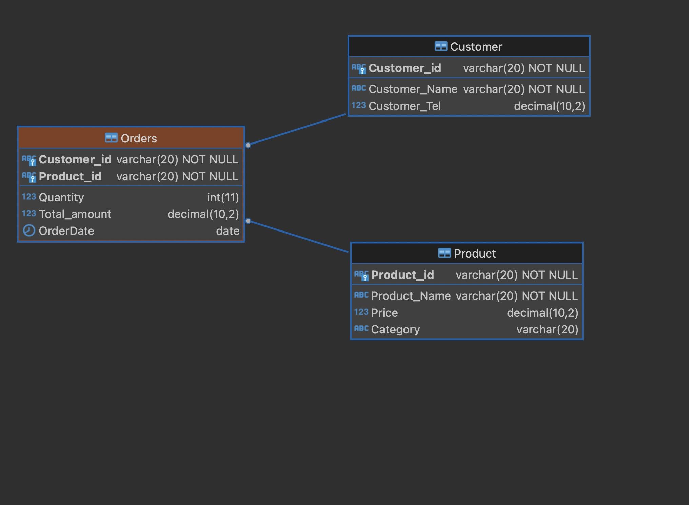

### Data definition language (DDL) Checkpoint

    

### Important Notes:
I used MySQL as DBMS so : 

VARCHAR2 (used in Oracle) becomes VARCHAR in MySQL.
NUMBER becomes DECIMAL(10,2) (or INT if the values are integers).
SYSDATE (used in Oracle) becomes CURRENT_DATE or CURRENT_TIMESTAMP in MySQL, depending on whether we need just the date or the full date and time. 