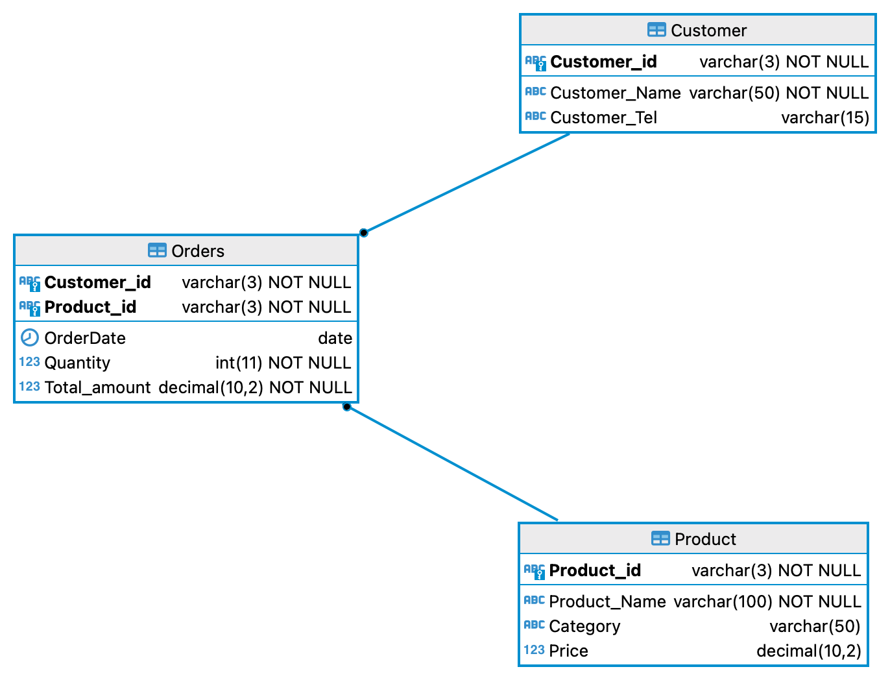
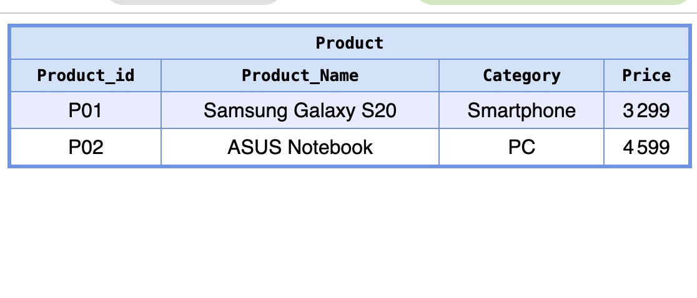
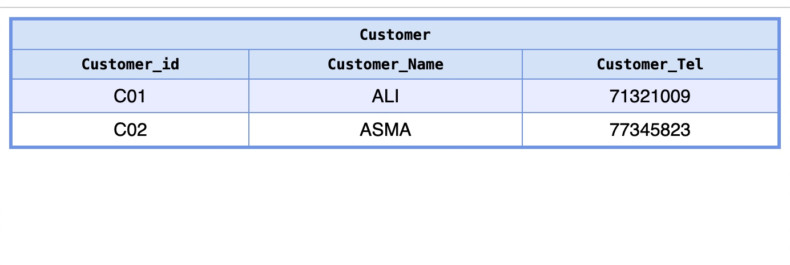
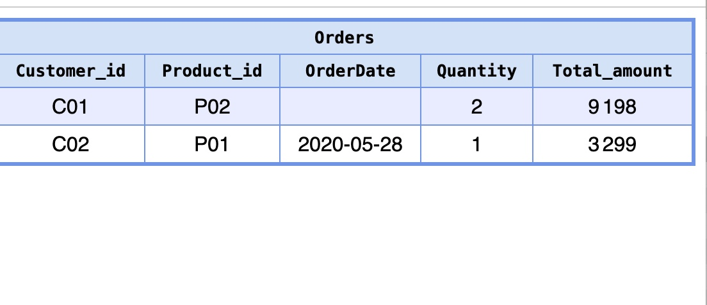

### Data manipulation language (DML)

Frist I created tables in my database
```SQL
-- 1. Create the Customer Table
CREATE TABLE Customer (
    Customer_id   VARCHAR(3) PRIMARY KEY,  -- Primary Key, used for referencing
    Customer_Name VARCHAR(50) NOT NULL,
    Customer_Tel  VARCHAR(15)
);

-- 2. Create the Product Table
CREATE TABLE Product (
    Product_id   VARCHAR(3) PRIMARY KEY,
    Product_Name VARCHAR(100) NOT NULL,
    Category     VARCHAR(50),
    Price        DECIMAL(10, 2)
);

-- 3. Create the Orders Table (Junction/Relationship Table)
CREATE TABLE Orders (
    Customer_id    VARCHAR(3),
    Product_id     VARCHAR(3),
    OrderDate      DATE,
    Quantity       INT NOT NULL,
    Total_amount   DECIMAL(10, 2) NOT NULL,
    
    -- Define the Composite Primary Key (PK is a combination of Customer_id and Product_id)
    PRIMARY KEY (Customer_id, Product_id), 
    
    -- Define Foreign Key constraints
    FOREIGN KEY (Customer_id) REFERENCES Customer(Customer_id),
    FOREIGN KEY (Product_id)  REFERENCES Product(Product_id)
);
```

Now let's Write SQL commands to insert the following rows into the corresponding tables
1. Table Customer (Customer_id, Customer_Name, Customer_Tel)
```SQL
INSERT INTO Customer (Customer_id, Customer_Name, Customer_Tel) 
VALUES ('C01', 'ALI', '71321009');

INSERT INTO Customer (Customer_id, Customer_Name, Customer_Tel) 
VALUES ('C02', 'ASMA', '77345823');
```

2. Table Product (Product_id, Product_Name, Category, Price)
```SQL
INSERT INTO Product (Product_id, Product_Name, Category, Price) 
VALUES ('P01', 'Samsung Galaxy S20', 'Smartphone', 3299);

INSERT INTO Product (Product_id, Product_Name, Category, Price) 
VALUES ('P02', 'ASUS Notebook', 'PC', 4599);
```
3. Table Orders (#Customer_id, #Product_id, OrderDate, Quantity, Total_amount)
```SQL
-- Commande 1
INSERT INTO Orders (Customer_id, Product_id, OrderDate, Quantity, Total_amount) 
VALUES ('C01', 'P02', NULL, 2, 9198);

-- Commande 2
INSERT INTO Orders (Customer_id, Product_id, OrderDate, Quantity, Total_amount) 
VALUES ('C02', 'P01', '2020-05-28', 1, 3299);
```
Table results : 


After insertions

    



### RESUME OF DML : 
The Data Manipulation Language provides queries to add data into tables, update data and delete data rows. There main three queries are :

- Insert
- Update
- Delete