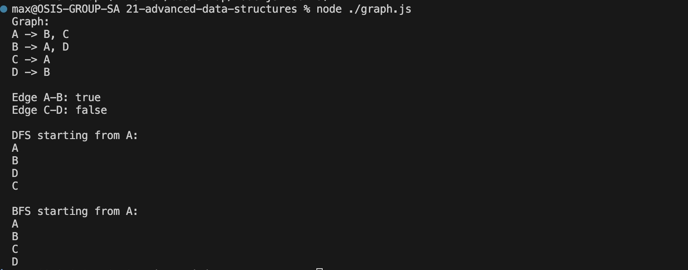

# Data Structures - Advanced Data Structures

### Demo 

Graph Implementation:
- Implement the Graph class with methods to add edges, remove edges, check for edges, and print the graph.
Traversal Algorithms:
- Implement the DFS and BFS methods to traverse the graph and print the order of the visited nodes.
- Make sure to handle both directed and undirected graphs.
Testing:
- Test your graph with at least 3 vertices and perform DFS and BFS traversals starting from one vertex.
- Verify the correctness of the output for both traversal methods