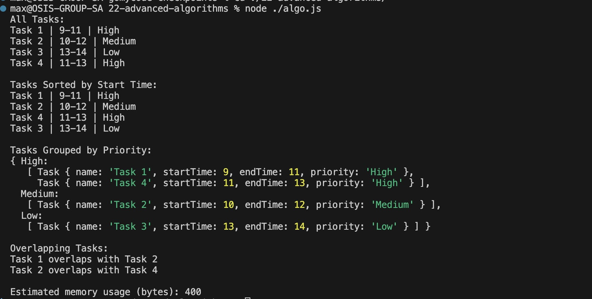

# Advanced Algorithms - Introduction to Efficient Solution

### Optimizing Task Scheduling System 
You are developing a lightweight task scheduler for a to-do application. The goal is to create efficient solutions for task management including sorting, filtering by priority, and identifying overlapping tasks while analyzing and improving the time and space complexity of each part.

The project focuses on translating common problem types into effective control structures and data models, and optimizing them through analysis.

