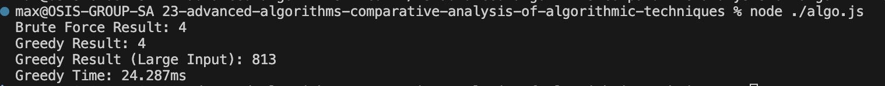

# Advanced Algorithms - comparative-analysis-of-algorithmic-techniques

### Choosing and Defending the Best Algorithm 
You’ve been hired to assist in optimizing a delivery platform backend system. The system receives a large number of delivery tasks, each with a start time and an end time. Your goal is to help the team implement an algorithm that selects the maximum number of non-overlapping tasks a single delivery driver can perform.

The team is currently debating between two solutions:

A brute-force implementation that explores all combinations
A greedy solution that selects tasks ending the earliest
You must analyze, compare, and recommend the most appropriate strategy for this system which operates in real-time and must handle thousands of tasks per second.

