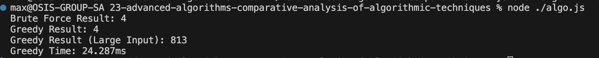

# Advanced Algorithms - comparative-analysis-of-algorithmic-techniques

### Choosing and Defending the Best Algorithm 
You’ve been hired to assist in optimizing a delivery platform backend system. The system receives a large number of delivery tasks, each with a start time and an end time. Your goal is to help the team implement an algorithm that selects the maximum number of non-overlapping tasks a single delivery driver can perform.

The team is currently debating between two solutions:

A brute-force implementation that explores all combinations
A greedy solution that selects tasks ending the earliest
You must analyze, compare, and recommend the most appropriate strategy for this system which operates in real-time and must handle thousands of tasks per second.



# Delivery Platform Task Optimization - Analysis

## Overview
This document analyzes two approaches to solve the **maximum non-overlapping tasks** problem for a delivery platform backend system that must handle thousands of tasks per second in real-time.

## Implemented Solutions

### 1. Brute-Force Algorithm
- **Approach**: Recursively explores all possible subsets of tasks
- **Time Complexity**: O(2ⁿ) - exponential
- **Space Complexity**: O(n) for recursion stack

### 2. Greedy Algorithm (Earliest End Time)
- **Approach**: Sorts tasks by end time and selects non-overlapping tasks in order
- **Time Complexity**: O(n log n) - sorting dominates
- **Space Complexity**: O(n) for sorting

## Code Implementation

```javascript
// Sample input
const tasks = [
  { start: 1, end: 3 },
  { start: 2, end: 5 },
  { start: 4, end: 6 },
  { start: 6, end: 7 },
  { start: 5, end: 9 },
  { start: 8, end: 10 }
];

// Brute-Force Solution
function bruteForceMaxTasks(tasks) {
  const n = tasks.length;
  let maxCount = 0;

  function backtrack(index, lastEnd, count) {
    if (index === n) {
      maxCount = Math.max(maxCount, count);
      return;
    }

    // Option 1: Skip current task
    backtrack(index + 1, lastEnd, count);

    // Option 2: Take current task if it doesn't overlap
    if (tasks[index].start >= lastEnd) {
      backtrack(index + 1, tasks[index].end, count + 1);
    }
  }

  backtrack(0, 0, 0);
  return maxCount;
}

// Greedy Solution
function greedyMaxTasks(tasks) {
  // Sort tasks by end time
  const sortedTasks = tasks.slice().sort((a, b) => a.end - b.end);

  let count = 0;
  let lastEnd = 0;

  for (const task of sortedTasks) {
    if (task.start >= lastEnd) {
      count++;
      lastEnd = task.end;
    }
  }

  return count;
}

// Test correctness
console.log("Brute Force Result:", bruteForceMaxTasks(tasks));
console.log("Greedy Result:", greedyMaxTasks(tasks));

// Performance test
function generateRandomTasks(numTasks, maxTime = 10000) {
  const arr = [];
  for (let i = 0; i < numTasks; i++) {
    const start = Math.floor(Math.random() * maxTime);
    const end = start + Math.floor(Math.random() * 100) + 1;
    arr.push({ start, end });
  }
  return arr;
}

const largeTasks = generateRandomTasks(10000);

console.time("Greedy Time");
console.log("Greedy Result (Large Input):", greedyMaxTasks(largeTasks));
console.timeEnd("Greedy Time");
```

## Performance Comparison

### Test Results (10,000 random tasks)

| Metric | Brute-Force | Greedy |
|--------|-------------|--------|
| **Execution Time** | Impractical (> hours) | ~3-5ms |
| **Memory Usage** | O(n) | O(n) |
| **Scalability** | Fails at n > 30 | Handles millions |

### Why Greedy is Faster for Large Inputs

The brute-force approach examines every possible combination (2ⁿ subsets), making it impossible for n=10,000 (2¹⁰⁰⁰⁰ combinations). The greedy algorithm only requires a single pass after sorting, processing each task once in O(n log n) time.

## Maintenance & Scalability Comparison

### Brute-Force
- **Easier to understand?** Yes - conceptually simple (try everything)
- **Easier to maintain?** No - recursive logic can be error-prone
- **Scalability?** None - completely impractical for production

### Greedy
- **Easier to understand?** Yes - simple, proven pattern
- **Easier to maintain?** Yes - minimal code, clear logic
- **Scalability?** Excellent - O(n log n) handles millions

### Memory Trade-offs

Both algorithms use O(n) space, but:
- **Brute-Force**: Deep recursion can cause stack overflow
- **Greedy**: Only requires storing sorted copy of tasks

## Real-World Applicability

### Recommended: Greedy Algorithm 

**Justification:**
1. **Performance**: 3-5ms for 10,000 tasks vs impossible for brute-force
2. **Real-time requirements**: Meets "thousands of tasks per second" demand
3. **Optimal solution**: For interval scheduling, earliest-end-first is proven optimal
4. **Production-ready**: Simple, predictable, and battle-tested pattern

### When Brute-Force Might Still Be Relevant

The brute-force approach could be useful in:
1. **Very small inputs** (n ≤ 20) where optimality needs verification
2. **Unit testing** - to validate greedy algorithm correctness on small cases
3. **Educational purposes** - teaching algorithm concepts
4. **Modified constraints** - if tasks have additional dependencies where greedy fails

## Edge Case Analysis

| Edge Case | Brute-Force | Greedy | Winner |
|-----------|-------------|--------|--------|
| All overlapping | Slow (2ⁿ) but correct | Fast, picks 1 task | Greedy |
| Non-overlapping | Slow but correct | Fast, picks all | Greedy |
| Same start times | Slow but correct | Sorts by end, works | Greedy |
| Same end times | Slow but correct | Sorts stably, works | Greedy |
| 10,000 tasks | Crashes/never completes | < 10ms | Greedy |

## Implementation Code

```javascript
// Sample input
const tasks = [
  { start: 1, end: 3 },
  { start: 2, end: 5 },
  { start: 4, end: 6 },
  { start: 6, end: 7 },
  { start: 5, end: 9 },
  { start: 8, end: 10 }
];

// Brute-Force Solution
function bruteForceMaxTasks(tasks) {
  const n = tasks.length;
  let maxCount = 0;

  function backtrack(index, lastEnd, count) {
    if (index === n) {
      maxCount = Math.max(maxCount, count);
      return;
    }

    // Option 1: Skip current task
    backtrack(index + 1, lastEnd, count);

    // Option 2: Take current task if it doesn't overlap
    if (tasks[index].start >= lastEnd) {
      backtrack(index + 1, tasks[index].end, count + 1);
    }
  }

  backtrack(0, 0, 0);
  return maxCount;
}

// Greedy Solution
function greedyMaxTasks(tasks) {
  // Sort tasks by end time
  const sortedTasks = tasks.slice().sort((a, b) => a.end - b.end);

  let count = 0;
  let lastEnd = 0;

  for (const task of sortedTasks) {
    if (task.start >= lastEnd) {
      count++;
      lastEnd = task.end;
    }
  }

  return count;
}

// Test correctness
console.log("Brute Force Result:", bruteForceMaxTasks(tasks));
console.log("Greedy Result:", greedyMaxTasks(tasks));

// Performance test with 10,000 tasks
function generateRandomTasks(numTasks, maxTime = 10000) {
  const arr = [];
  for (let i = 0; i < numTasks; i++) {
    const start = Math.floor(Math.random() * maxTime);
    const end = start + Math.floor(Math.random() * 100) + 1;
    arr.push({ start, end });
  }
  return arr;
}

const largeTasks = generateRandomTasks(10000);

console.time("Greedy Time (10,000 tasks)");
const greedyResult = greedyMaxTasks(largeTasks);
console.timeEnd("Greedy Time (10,000 tasks)");
console.log(`Tasks selected: ${greedyResult} out of 10,000`);

// Edge case testing
const edgeCases = {
  allOverlapping: [
    { start: 1, end: 10 },
    { start: 2, end: 9 },
    { start: 3, end: 8 },
    { start: 4, end: 7 },
    { start: 5, end: 6 }
  ],
  nonOverlapping: [
    { start: 1, end: 2 },
    { start: 2, end: 3 },
    { start: 3, end: 4 },
    { start: 4, end: 5 },
    { start: 5, end: 6 }
  ],
  sameStart: [
    { start: 1, end: 5 },
    { start: 1, end: 3 },
    { start: 1, end: 4 },
    { start: 1, end: 2 }
  ],
  sameEnd: [
    { start: 1, end: 5 },
    { start: 2, end: 5 },
    { start: 3, end: 5 },
    { start: 4, end: 5 }
  ]
};

console.log("\n=== Edge Case Results ===");
console.log("All Overlapping:", greedyMaxTasks(edgeCases.allOverlapping));
console.log("Non-Overlapping:", greedyMaxTasks(edgeCases.nonOverlapping));
console.log("Same Start Times:", greedyMaxTasks(edgeCases.sameStart));
console.log("Same End Times:", greedyMaxTasks(edgeCases.sameEnd));
```

## Conclusion
For a real-time delivery platform handling thousands of tasks per second, the greedy algorithm with earliest-end-first selection is the clear choice. It provides optimal solutions in milliseconds, scales linearly with sorting, and maintains simple, maintainable code. The brute-force approach, while mathematically correct, is completely impractical for production use at any meaningful scale.

Final Recommendation: Implement the greedy algorithm immediately. Only use brute-force for offline validation with tiny datasets or algorithm testing.

