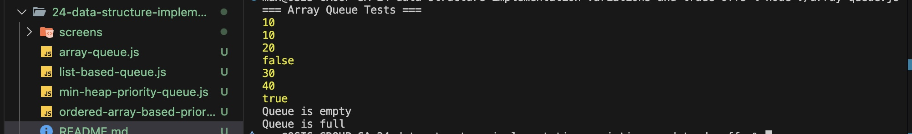
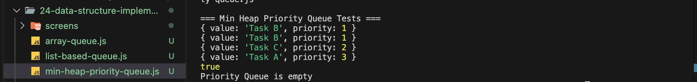

# Data Structures - Implementation variations and trade-offs

implement two different variations of a Queue and a Priority Queue to practice understanding their implementation trade-offs. You will implement both

#### Array Queue Tests case

#### Min Heap Priority Queue Tests case

