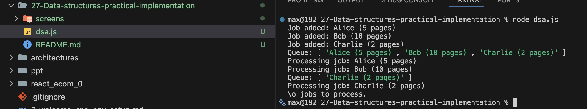

# Data Structures - Practical Implementation

## Simulating a Print Queue

In an office, there is a shared printer, and multiple employees send print jobs to the printer. These print jobs are processed in the order they are received, following the First-In-First-Out (FIFO) principle.

You need to simulate the behavior of the printer system using a queue data structure. The system should:

Accept print jobs (which consist of a name and a number of pages).
 
Process jobs one by one in the order they were received.

#### Tests case

