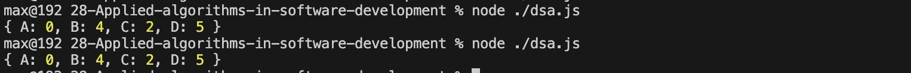

# Applied Algorithms in Software Development

Implementing Dijkstra's Algorithm in JavaScript

The objective of this task is to implement Dijkstra's algorithm in JavaScript to find the shortest path in a weighted graph. By completing this task, you will gain practical experience in implementing a fundamental graph algorithm and understanding its application in solving real-world problems.


#### Tests case
```js
const printer = new PrinterQueue();
const graph = {
    'A': { 'B': 4, 'C': 2 },
    'B': { 'A': 4, 'C': 5, 'D': 10 },
    'C': { 'A': 2, 'B': 5, 'D': 3 },
    'D': { 'B': 10, 'C': 3 }
};

const shortestDistances = dijkstra(graph, 'A');
console.log(shortestDistances);
```

### Test results

