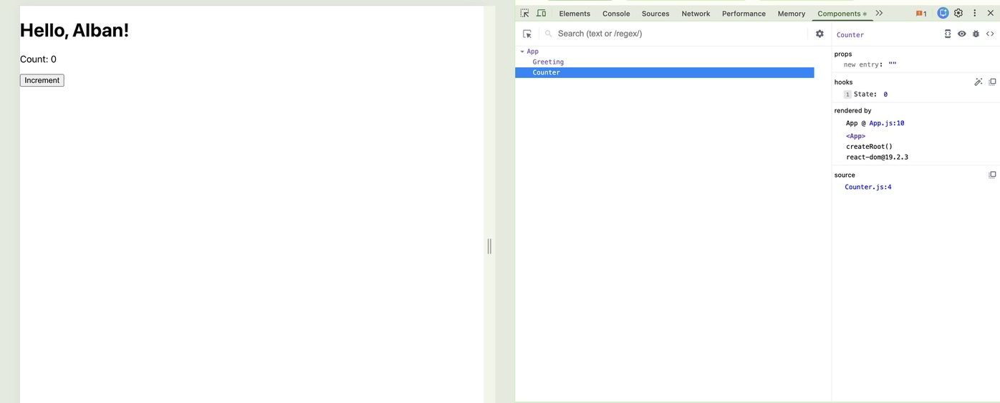

# Identify issues

### Counter.js (Before fixed)
```js
import React, { useState } from "react";

const Counter = () => {
  const [count, setCount] = useState(0);

  // Example issue: increment logic accidentally doubled
  const increment = () => setCount(count + 2);

  return (
    <div>
      <p>Count: {count}</p>
      <button onClick={increment}>Increment</button>
    </div>
  );
};

export default Counter;
```

### Counter.js (fixed increment issue)
```
  const increment = () => setCount(count + 1);
```



## Available Scripts

In the project directory, you can run:

### `npm i && npm run start`

Runs the app in the development mode.\
Open [http://localhost:3000](http://localhost:3000) to view it in your browser.

The page will reload when you make changes.\
You may also see any lint errors in the console.

