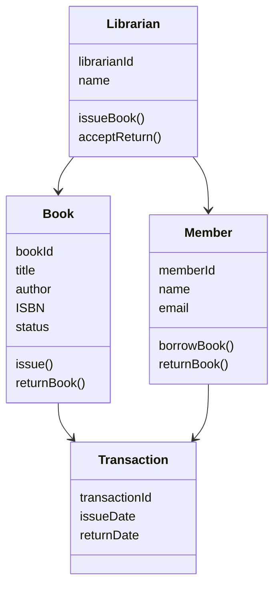
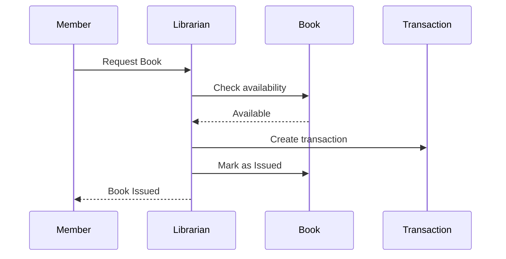
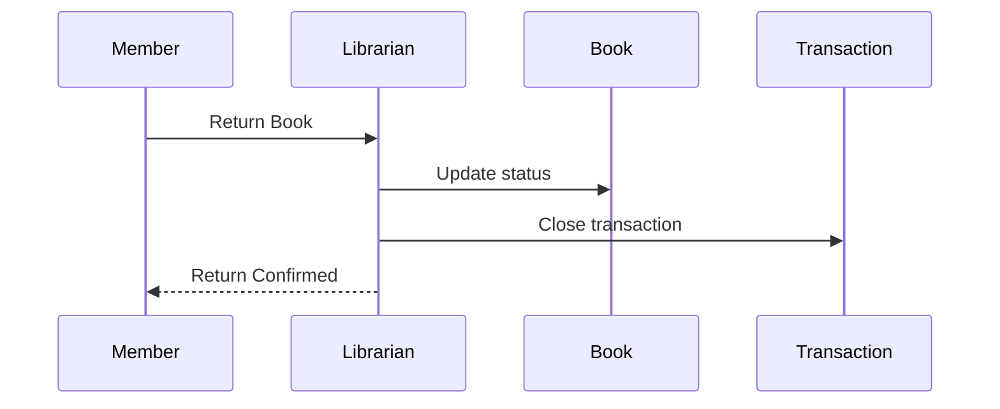
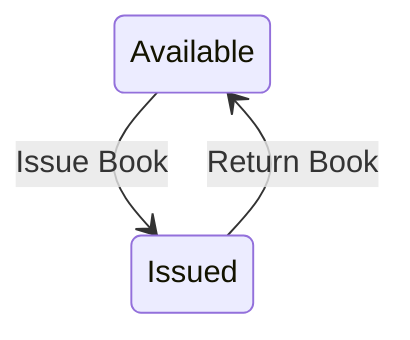

# Library Management System – Object-Oriented Analysis (OOA)

## 1) Requirement Analysis

### Main Actors
- **Librarian**
  - Manages books
  - Issues and returns books
  - Manages members
- **Member**
  - Searches books
  - Borrows and returns books
  - Views borrowing history
- **Admin (optional)**
  - Manages librarian accounts
  - Oversees system settings

### Key Use Cases
- Search Book
- Add / Remove Book
- Register Member
- Issue Book
- Return Book
- View Borrowing History
- Calculate Fine (optional)

---

## 2) System Architecture Design

### Major Components (Layered Architecture)
```
+----------------------+
| Presentation/UI |
| (Web / Desktop UI) |
+----------▲-----------+
|
+----------+-----------+
| Business Logic |
| (Services & Rules) |
+----------▲-----------+
|
+----------+-----------+
| Data Access Layer |
| (Repositories / DB) |
+----------------------+
```

### Component Responsibilities
- **UI Layer**: Handles user input and displays output
- **Business Logic Layer**: Enforces rules (e.g., availability, borrowing limits)
- **Data Access Layer**: Stores and retrieves books, members, transactions

---

## 3) Object-Oriented Analysis (OOA)

### Core Classes Identified

#### Book
- **Attributes**: bookId, title, author, ISBN, status (Available, Issued)
- **Methods**: issue(), returnBook(), getStatus()

#### Member
- **Attributes**: memberId, name, email, borrowedBooks
- **Methods**: borrowBook(), returnBook(), viewHistory()

#### Librarian
- **Attributes**: librarianId, name
- **Methods**: addBook(), removeBook(), issueBook(), acceptReturn()

#### Transaction
- **Attributes**: transactionId, book, member, issueDate, returnDate
- **Methods**: createTransaction(), closeTransaction()

---

### Class Diagram (Mermaid)



### 4) Use Case & Sequence Diagrams
- Use Case Diagram
- Actors: Librarian, Member
- Use Cases: Search Book, Issue Book, Return Book, Manage Books, Manage Members

#### Sequence Diagram – Issue Book


#### Sequence Diagram – Return Book


#### State Diagram – Book Object


#### Data, Functional & Behavioral Modeling

## Data Model

### Entities
- **Book**
- **Member**
- **Librarian**
- **Transaction**

### Relationships
- One **Member** → Many **Transactions**
- One **Book** → Many **Transactions** (over time)

---

## Functional Model

The system provides the following functionalities:

1. **Add Book** – Add new books to the library catalog.
2. **Search Book** – Search for books by title, author, or ISBN.
3. **Issue Book** – Issue books to members.
4. **Return Book** – Return issued books and update records.
5. **Register Member** – Register new library members.
6. **Maintain Transaction Records** – Keep track of all book issues and returns.

---

## Behavioral Model

- **Book State Changes:**  
  `Available → Issued → Available`  
  Books change their availability status as they are issued and returned.

- **Member Actions:**  
  Member actions (issue/return) trigger transactions in the system.

- **Librarian Role:**  
  The librarian enforces system rules, manages books, and oversees transactions.

---

## Usage

1. Librarian logs into the system.
2. Add or search for books as needed.
3. Register new members.
4. Issue books to members and maintain transaction records.
5. Update the system when books are returned.

#### 5) Abstraction → Implementation (JavaScript)

Book Class
```js
class Book {
    constructor(bookId, title, author, ISBN) {
        this.bookId = bookId;
        this.title = title;
        this.author = author;
        this.ISBN = ISBN;
        this.status = "Available";
    }

    issue() {
        if (this.status === "Available") {
            this.status = "Issued";
            return true;
        }
        return false;
    }

    returnBook() {
        this.status = "Available";
    }

    getStatus() {
        return this.status;
    }
}
```

Member Class
```js
class Member {
    constructor(memberId, name, email) {
        this.memberId = memberId;
        this.name = name;
        this.email = email;
        this.borrowedBooks = [];
    }

    borrowBook(book) {
        if (book.issue()) {
            this.borrowedBooks.push(book);
            console.log(`${this.name} borrowed "${book.title}"`);
        } else {
            console.log(`"${book.title}" is not available.`);
        }
    }

    returnBook(book) {
        const index = this.borrowedBooks.indexOf(book);
        if (index > -1) {
            book.returnBook();
            this.borrowedBooks.splice(index, 1);
            console.log(`${this.name} returned "${book.title}"`);
        }
    }
}
```

Librarian Class
```js
class Librarian {
    constructor(librarianId, name) {
        this.librarianId = librarianId;
        this.name = name;
        this.books = [];
    }

    addBook(book) {
        this.books.push(book);
        console.log(`Book "${book.title}" added to the library.`);
    }

    removeBook(book) {
        const index = this.books.indexOf(book);
        if (index > -1) {
            this.books.splice(index, 1);
            console.log(`Book "${book.title}" removed from the library.`);
        }
    }

    issueBook(book, member) {
        member.borrowBook(book);
    }

    acceptReturn(book, member) {
        member.returnBook(book);
    }
}
```
