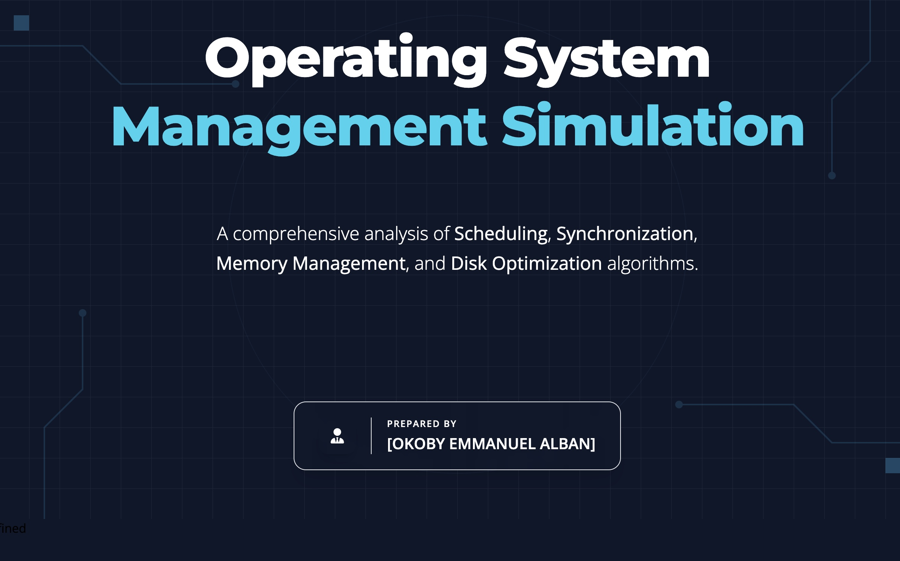
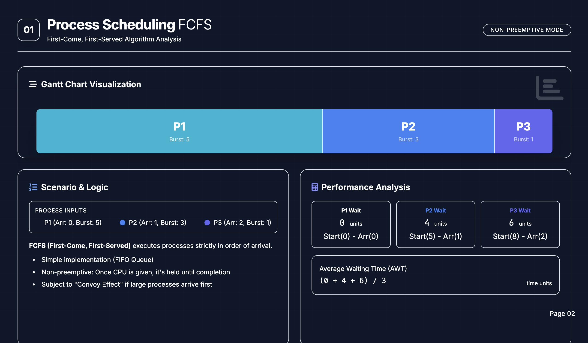
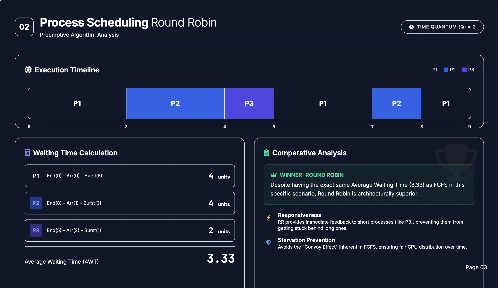
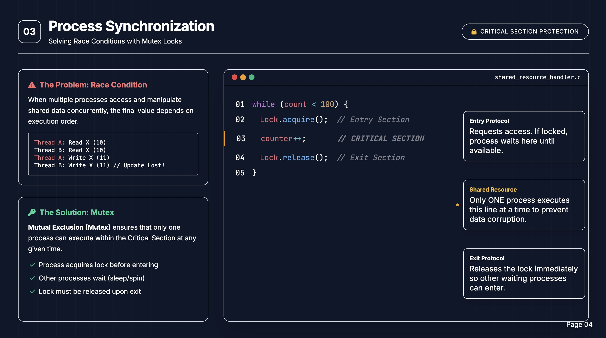
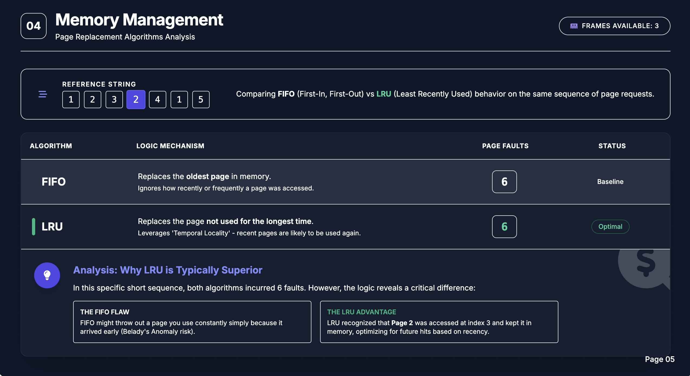
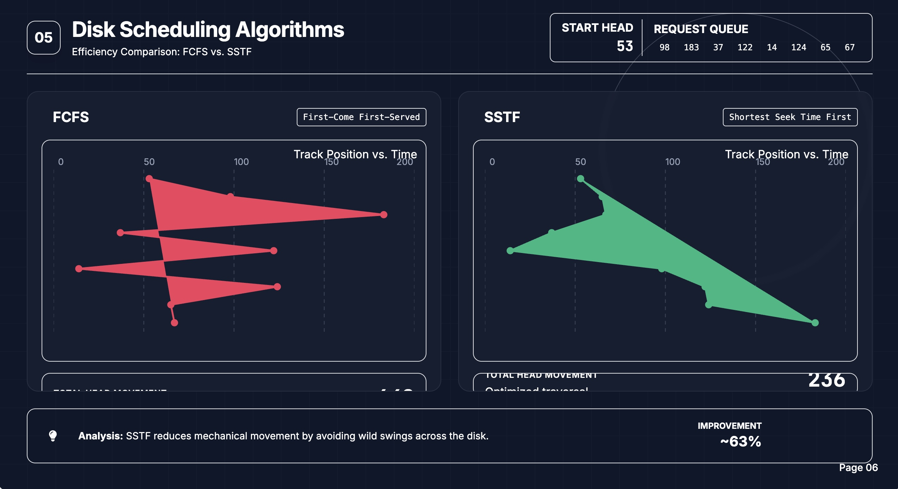
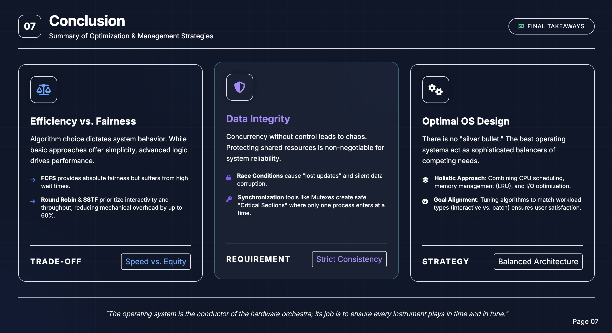

# OS Management Simulation: Process, Memory, and Disk

## Project Overview
This project simulates how an Operating System (OS) handles core responsibilities including task scheduling, resource synchronization, memory allocation, and disk I/O optimization. The goal is to compare standard algorithms to determine which provides the best balance of efficiency and responsiveness.

