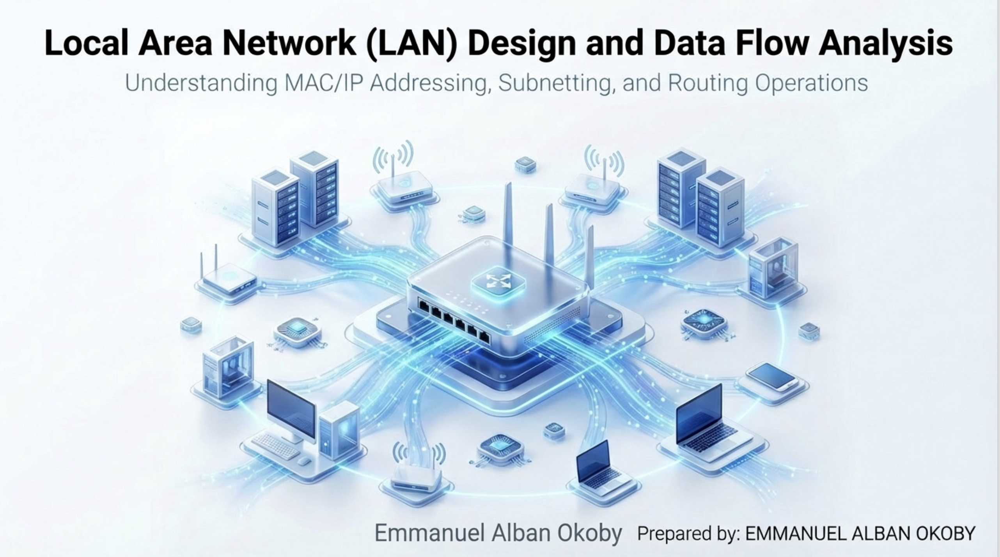
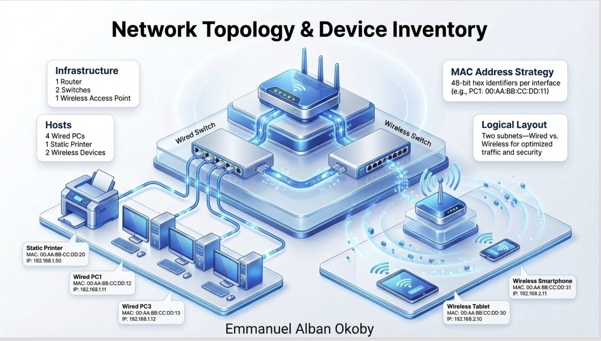
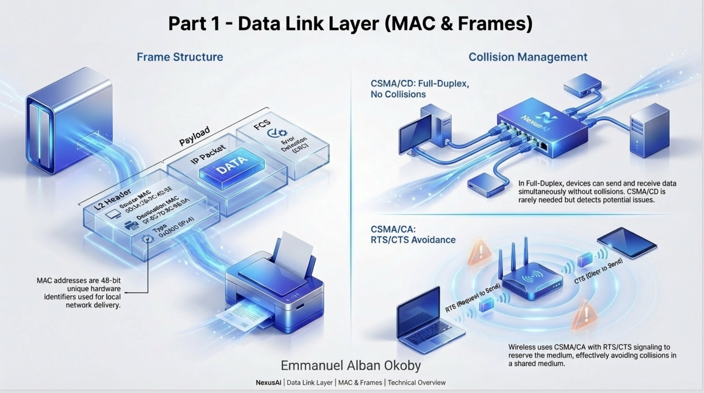
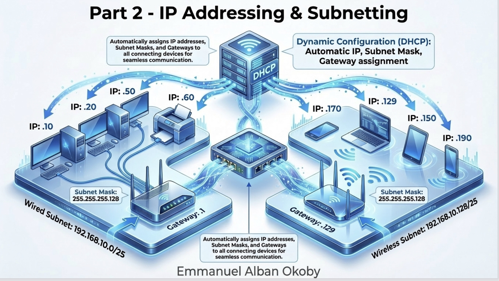
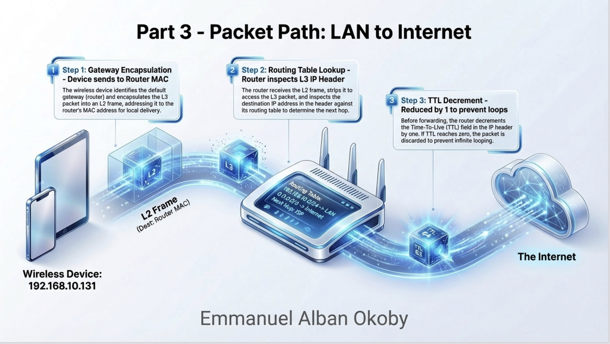
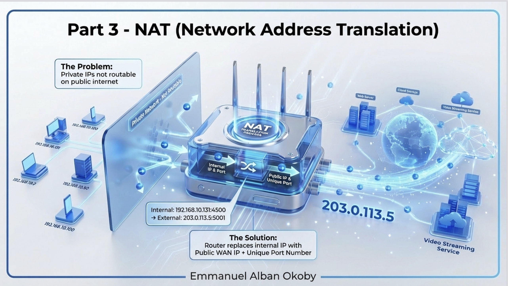
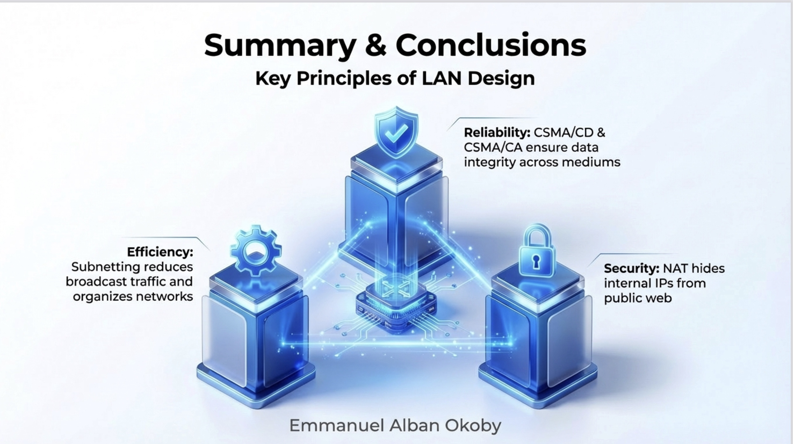

# Computer Systems and Their Fundamentals : Introduction to Computer Networks and Layers

## Project Overview
This project involves the design and analysis of a small-scale Local Area Network (LAN) for a corporate environment. It demonstrates the journey of data from the physical hardware level (MAC addresses) through logical addressing (Subnetting) and out to the public internet (NAT/Routing).

