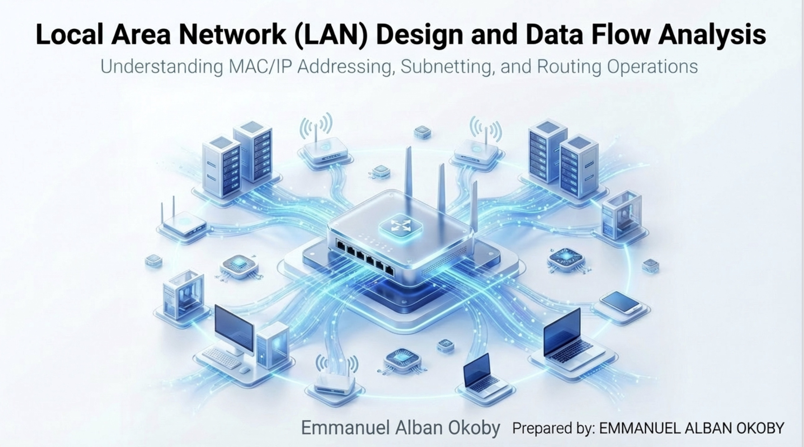
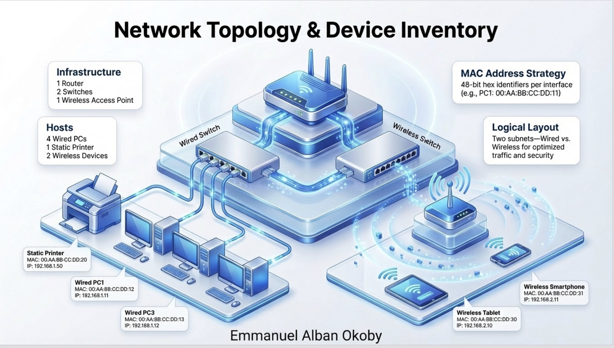
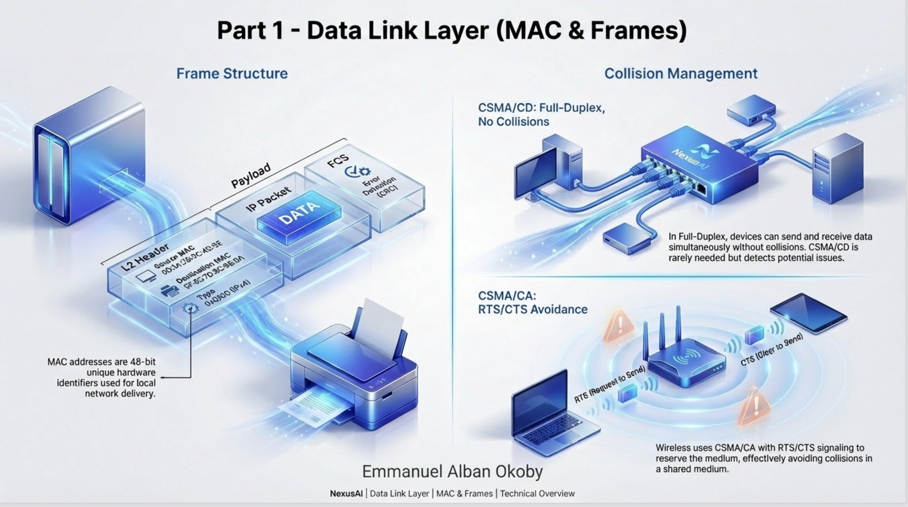
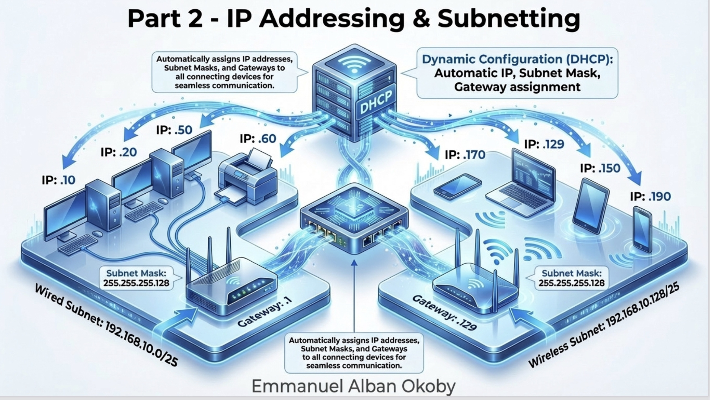
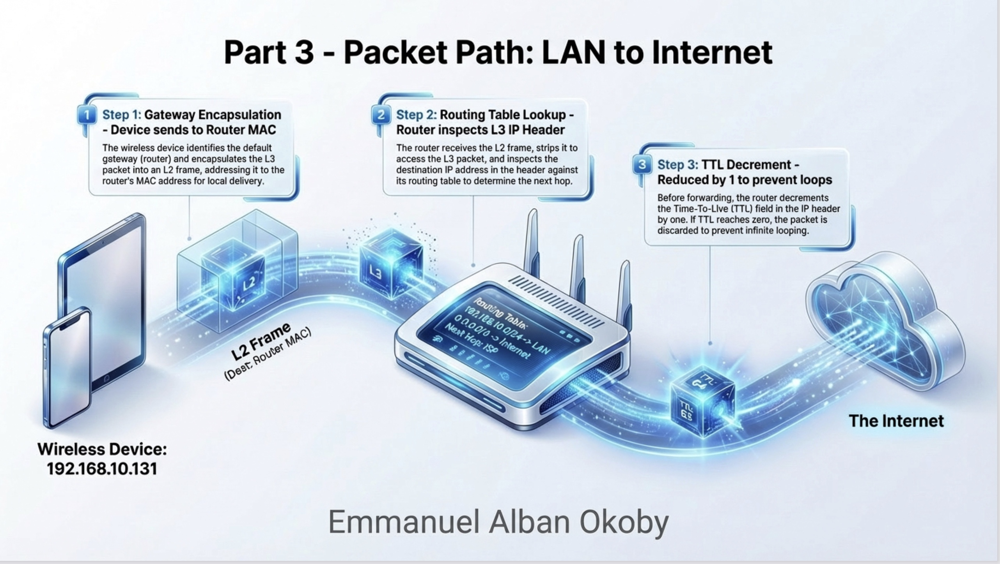
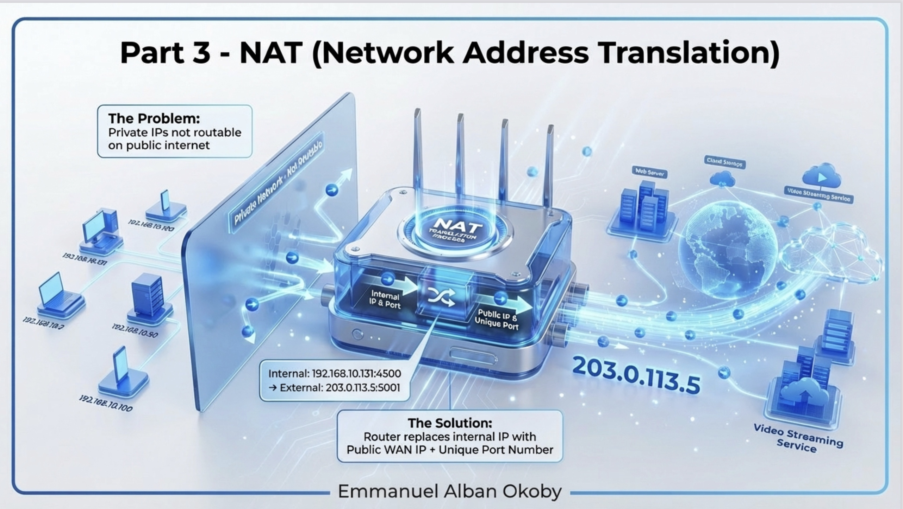

# Computer Systems and Their Fundamentals : Introduction to Computer Networks and Layers

## Project Overview
This repository contains the technical specifications and architectural analysis for a small-scale corporate Local Area Network (LAN). The project demonstrates proficiency in OSI Model layers 2 and 3, subnetting, and routing logic.

## Network Topology
* **1 Edge Router:** Provides Internet access and NAT services.
* **2 Managed Switches:** Handles wired distribution for the office floor.
* **4 Employee PCs:** Wired workstations (Subnet A).
* **1 Network Printer:** Shared resource (Subnet A).
* **1 Wireless Access Point (WAP):** Connectivity for mobile devices (Subnet B).

---

## Project Structure

### 1. MAC & Frame Handling (Layer 2)
* **Addressing:** Unique 48-bit physical addresses assigned to all NICs.
* **Frame Structure:** Detailed breakdown of Ethernet II frames sent between PCs and the Printer.
* **Collision Domains:** * **Ethernet:** Implementation of CSMA/CD logic.
    * **Wi-Fi:** Implementation of CSMA/CA with RTS/CTS handshaking.

### 2. IP Addressing & Subnetting (Layer 3)
* **Network Space:** `192.168.10.0/24`
* **Segmentation:**
    * **Wired Subnet:** `192.168.10.0/25` (Gateway: `.1`)
    * **Wireless Subnet:** `192.168.10.128/25` (Gateway: `.129`)
* **DHCP:** Automated IP allocation for dynamic clients.

### 3. Routing & Packet Life Cycle
Analysis of a packet's journey from a wireless client to a public web server (`8.8.8.8`), including:
* **TTL Decrementation:** Preventing infinite loops.
* **Routing Table Lookups:** Finding the "Next Hop."
* **NAT (Network Address Translation):** Mapping private IPs to a single public WAN address.

---

## How to Use
1.  **Documentation:** Open `Network_Report.pdf` for the full analysis and diagrams.
2.  **Configuration:** See `/configs` for simulated Cisco IOS router and switch settings.
3.  **Simulation:** The `.pkt` file can be opened in **Cisco Packet Tracer** to visualize real-time traffic flow.

---

## Quick Reference Table: IP Plan

| Device | IP Address | MAC Address |
| :--- | :--- | :--- |
| Router (LAN) | 192.168.10.1 | 00:0A:95:9D:68:16 |
| PC 1 | 192.168.10.2 | A1:B2:C3:D4:E5:01 |
| Printer | 192.168.10.10 | B1:C2:D3:E4:F5:01 |
| Wireless 1 | 192.168.10.130 | D1:E2:F3:G4:H5:01 |

