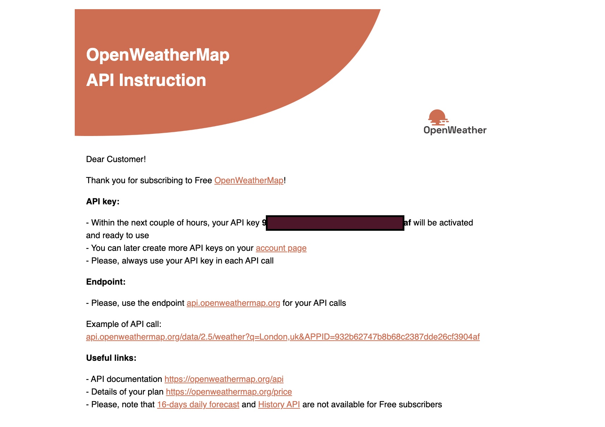
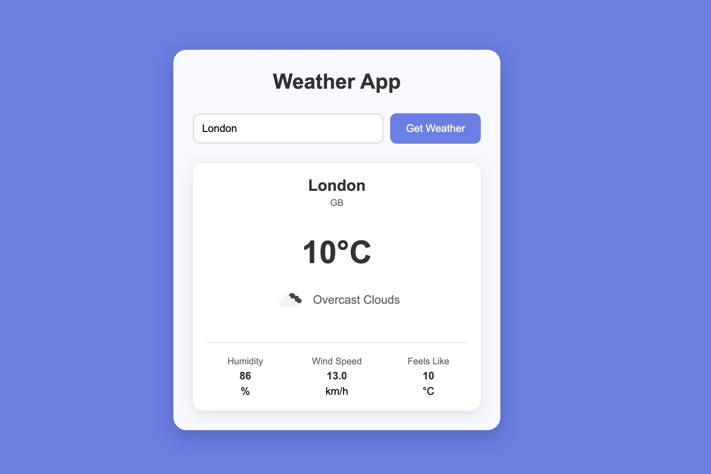

# Network Request in JavaSript

This repository contains examples of using `Network Request` in JavaScript

## How to Set Up:
### Get an API Key:

- Go to OpenWeatherMap
- Sign up for a free account
- Go to your dashboard and get your API key
- Replace 'API_KEY_HERE' in script.js with your actual API key

### Run the App:

- Simply open the index.html file in a web browser
- The app will load weather data for London by default

Search for any city to get its current weather

