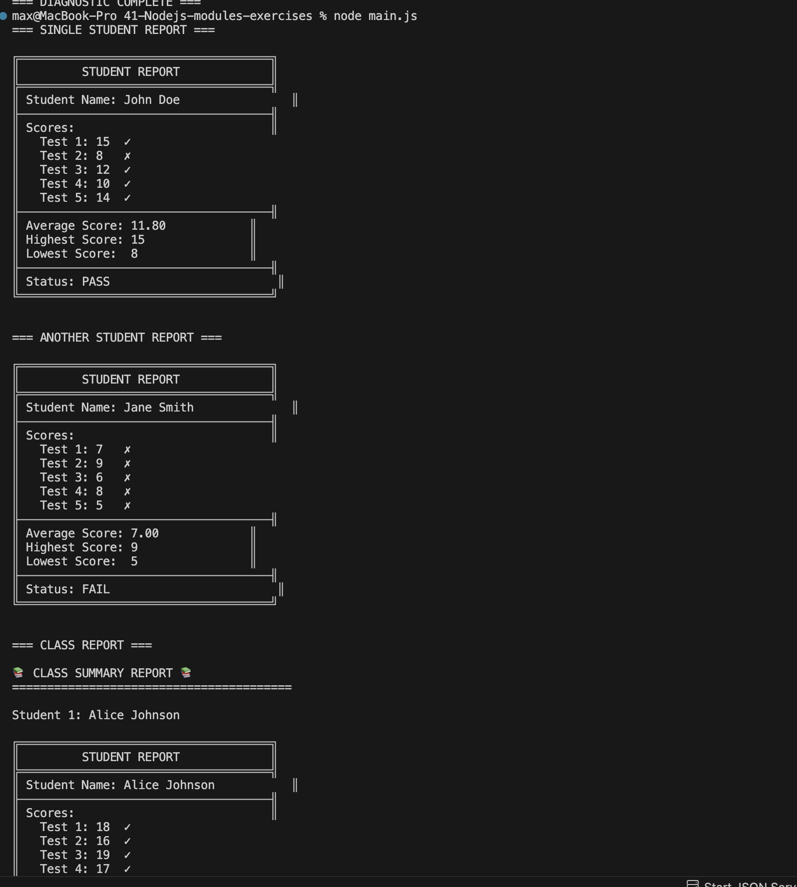
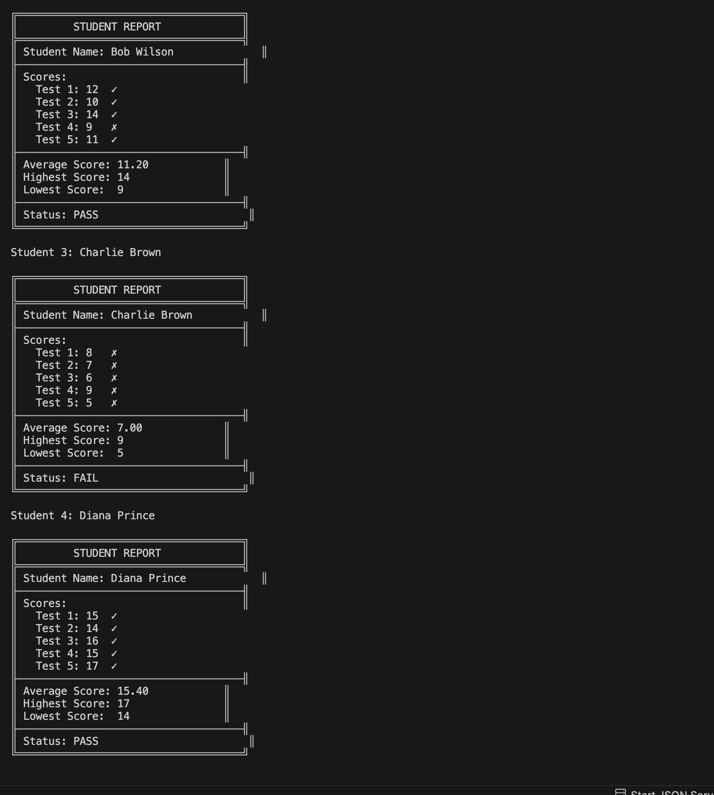
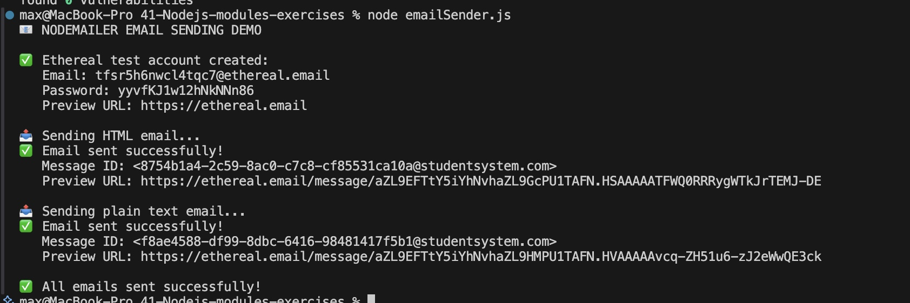
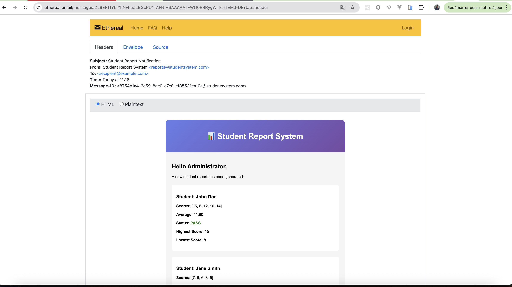
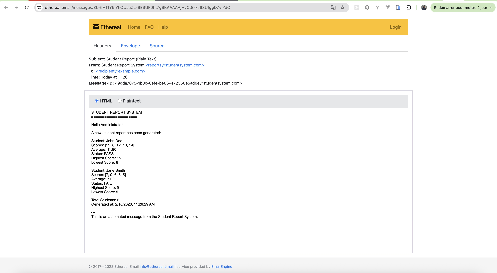

# Nodejs modules

This repository contains examples of using `Nodejs Modules`

## Project Structure
```
nodejs-modules-exercises/
├── message.txt
├── readFile.js
├── reportGenerator.js
├── main.js
├── emailSender.js
├── package.json
└── node_modules/
```

## How to run the project 

### Run Task 1
``` 
node readFile.js
```


### Run Task 2
``` 
node main.js
```
Results



### Run Task 3
``` 
node emailSender.js
```
Results




