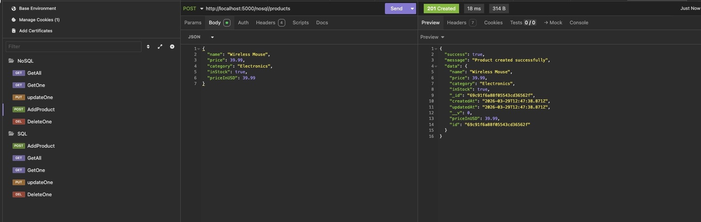
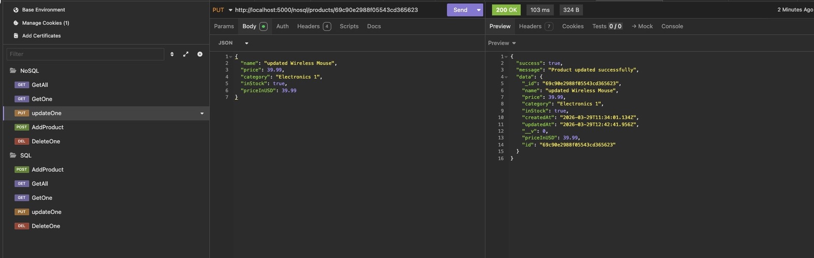
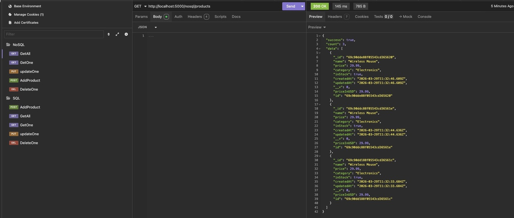
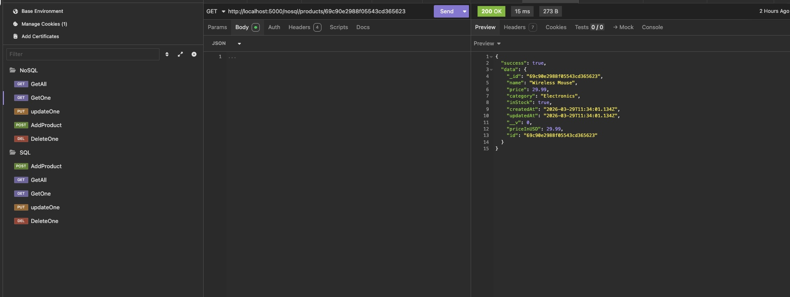
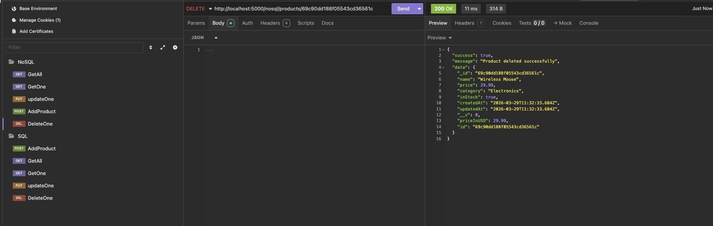

# Product CRUD Challenge: SQL & NoSQL Edition

This repository contains examples of using `SQL & NoSQL`

## Prerequis
- Docker
- Node (v18+)

## Create .env file 
Then add these values :
- DATABASE_URI: (The URL of your mongoose DB)
- PORT: Your API port number (5000 for example)

You must have somthing like that : 
```
PORT=5000

DATABASE_URI=mongodb://<username>:<password>@localhost:27017/<db-name>?authSource=admin
````


### Run the project
```bash 
docker compose up -d
```

```bash
npm i && npm run start
```
Then success 
Now you can access:
- MongoDB: localhost:27017
- Mongo Express UI: http://localhost:8081 (login: admin/admin123)
- API BASE URL: http://localhost:5000 or your specified port

## Screenshots 
#### Add product


#### Update product


#### Get all products


#### Get one product


#### Delete a product


### Project Structure
```45-product-crud-challenge-sql-and-nosql/
├── models/
│   ├── Product.js (Mongoose)
│   └── product.sql (MySQL table schema)
├── controllers/
│   ├── NoSQLcontroller.js
│   └── SQLcontroller.js
├── config/
│   ├── mongodb.js
│   └── mysql.js
├── app.js
├── .env
└── package.json
```

