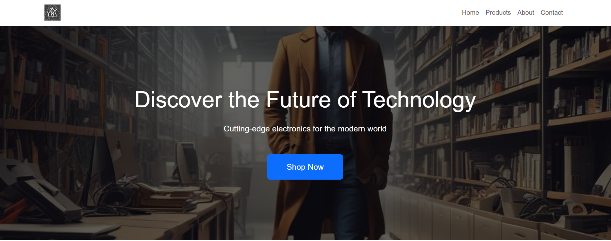
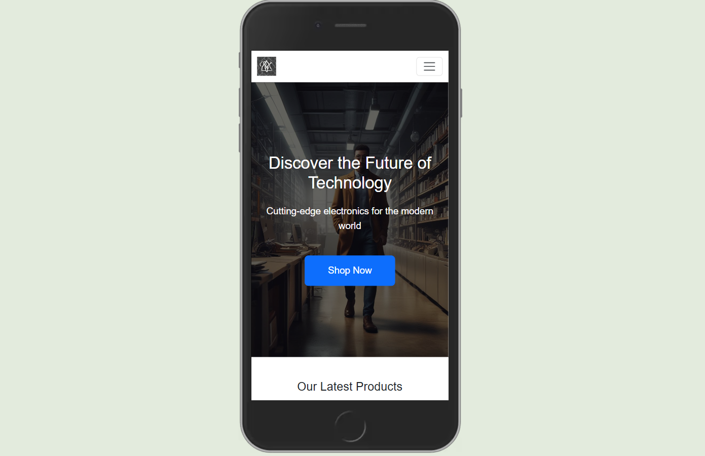
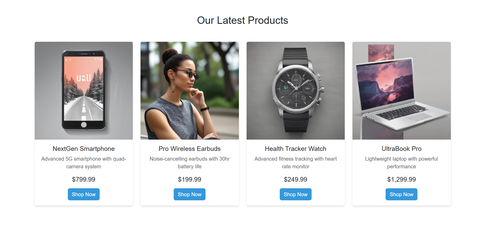
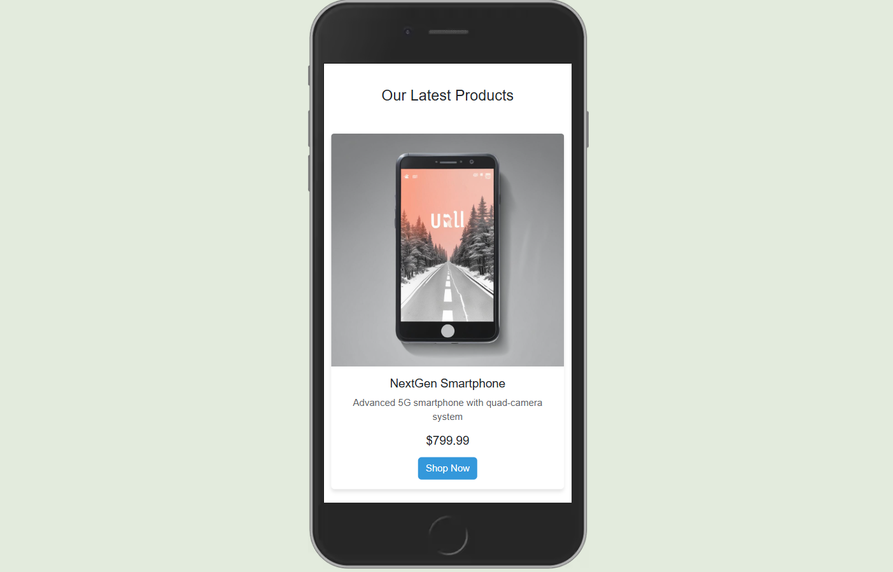
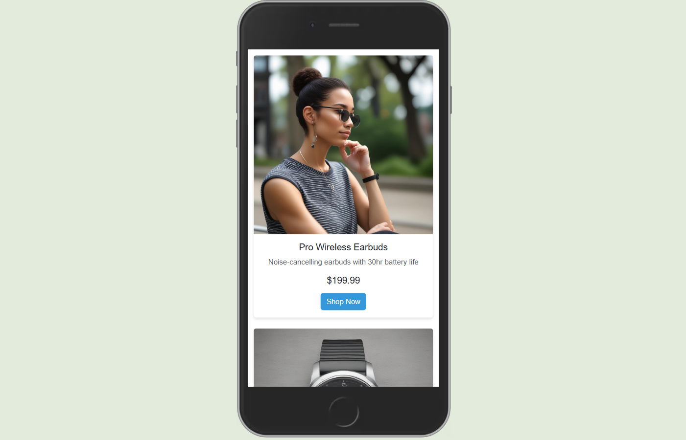
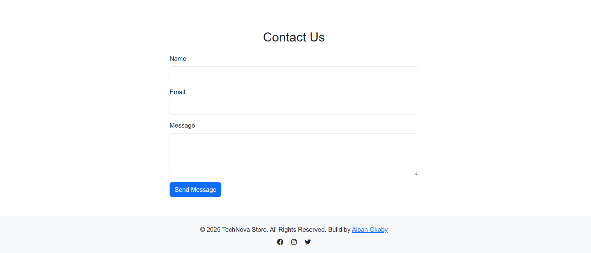
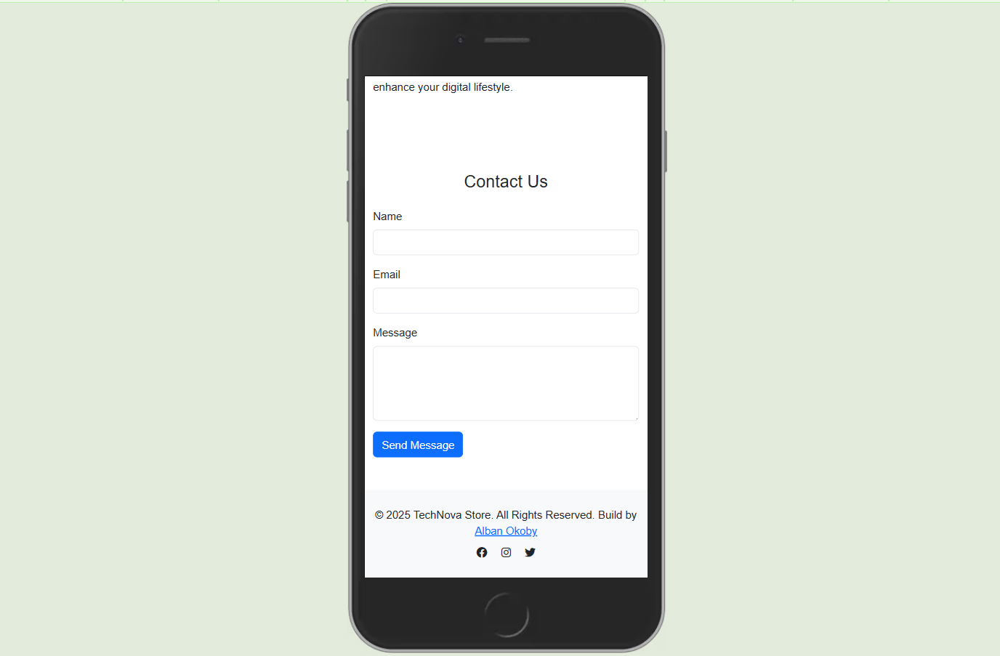

## UI/UX_FRONTEND (Store Landing Page Design project)
# TechNova Store

A modern, responsive website design using Bootstrap and custom CSS properties to create a clean, tech-forward user experience. This website features a dynamic, mobile-first layout, vibrant color scheme, and engaging interactions.

## Features

### Color Palette and Branding
- **Primary Color**: `#3498db` (Bright Blue) - Represents technology, innovation, and trust
- **Secondary Color**: `#2ecc71` (Vibrant Green) - Signifies growth, freshness, and energy
- **Custom CSS Properties**: Used for easy global theme management with root-level color definitions

### Typography and Layout
- **Primary Font**: 'Arial' for clean, modern readability
- **Responsive Typography**: Utilized Bootstrap’s `display-4` and `lead` classes for consistent text scaling
- **Mobile-First Layout**: Implemented with Bootstrap's `col-md-3` classes for responsive grid

## Technologies Used
- **HTML5**: Semantic structure for content
- **CSS3**: Custom properties for global theme management and CSS transitions
- **Bootstrap 5.3.2**: For responsive grid and components
- **Font Awesome**: Social media icons and vector icons

## Installation

1. Clone the repository:

   ```bash
   git clone https://github.com/alban-okoby/gomycode-checkpoints.git
   cd 5_ui_ux_design_responsive_store_landing_page_design
   
### Screenshots (Demo)















